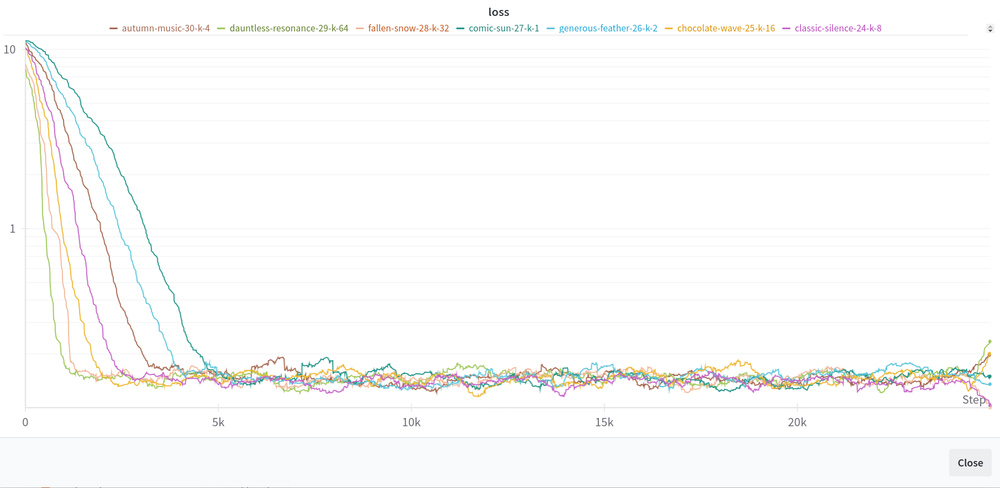

## Introduction

We train Top K sparsity based Sparse Autoencoder on ResNet50 model, using the weights ```ResNet50_Weights.IMAGENET1K_V2```.

To simplify the problem, we train only the activations of ```maxpool``` layer, for 0th channel ```[0,0,:32,:32]``` with an expansion factor of ```1``` and ```k=1,2,4,8,16,32```.


The dataset is taken from ```ILSVRC/imagenet-1k```.


## Loss for various k




## Table of shapes


| Layer Name | Output Shape |
|------------|---------------|
| maxpool | [1, 64, 56, 56] |
| layer1 | [1, 256, 56, 56] |
| layer2 | [1, 512, 28, 28] |
| layer3 | [1, 1024, 14, 14] |
| layer4 | [1, 2048, 7, 7] |

